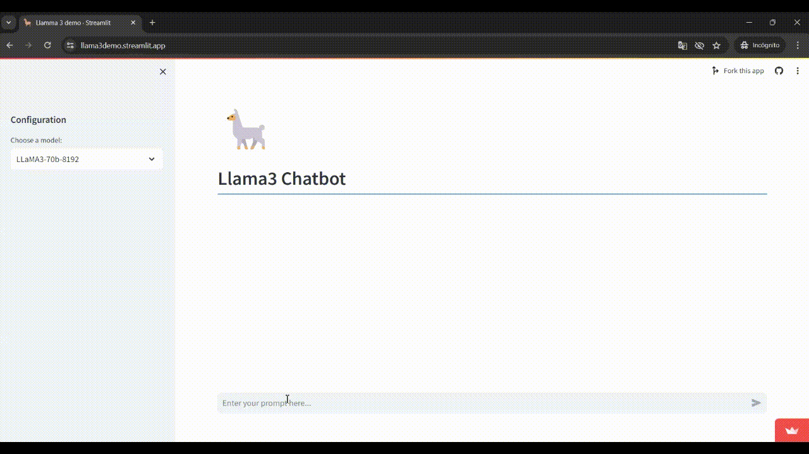

# Francisco Moya

**Data Scientist / Data Analyst**

**Phone:** +57 3127748590  
**Email:** frankj.mortiz@gmail.com  
**LinkedIn:** [Francisco Javier Moya Ortiz](https://www.linkedin.com/in/francisco-javier-mortiz/)  
**Github:** [fjmoyao](https://github.com/fjmoyao)   

## Profile
Data Scientist with a Master’s degree in Data Science and Analytics, specializing in advanced AI techniques, including machine learning and Natural Language Processing (NLP). With over three years of experience, I am proficient in designing and implementing machine learning models, ETL processes, and cloud computing solutions across platforms like Google Cloud and Azure. Experienced in developing dashboards for data-driven decision-making using tools like Data Studio, PowerBI, and Databricks. Passionate about leveraging analytics and AI to drive business innovation and decision-making.

## Projects

- **Llama 3 Chatbox**
  Implementation of a chatbox app using state of the art LLM Llama 3

  

  **Github:** [Llama 3 app](https://github.com/fjmoyao/llama_streamlit) 

  

- **Stress Detection using Attention Models**
  Implementation of an app for stress detection in text data using Attention Models (RoBERTa) and LLMs.

## Education

- **MSc in Data Science and Analytics**  
  [EAFIT University](https://www.eafit.edu.co/) - Medellín, Colombia (2021-present)  
  Thesis: "Applications of NLP and Attention Models for Stress Identification in Social Media Texts"

- **Bachelor of Science in Biomedical Engineering**  
  [University of the Andes](https://uniandes.edu.co/) - Bogotá, Colombia (2016-2021)  
  Capstone Project: "White matter tract segmentation with deep learning approaches."

## Professional Experience

### [IFCO Systems](https://www.ifco.com/) - Data Analyst, Medellín, Colombia (06/2023 - present)
- Enhanced strategic decision-making through comprehensive data analysis.
- Optimized supply chain modeling and improved resource planning.
- Streamlined data integration and usability of IoT device data.

### [Koggi Technologies](https://koggi.co/) - Data Analyst, Remote (10/2021 - 06/2023)
- Improved data quality management and optimized reporting systems.
- Led the development of ETL processes enhancing data security and validity.

### [Correlation One](https://www.correlation-one.com/) - Teaching Assistant, Remote (03/2022 - 06/2022)
- Mentored over 50 scholarship recipients in real-world data science projects.
- Provided educational leadership in data science through interactive lectures.

## Online Courses & Certifications
- **Become a PowerBI Specialist** - [LinkedIn Learning](https://www.linkedin.com/learning/) (Jul. 2023)
- **Data Science For All (DS4A)** - [Correlation One](https://www.credential.net/f6a31ede-5525-4aea-8516-87410b103cbe#gs.8ssqo7) (Sep. 2021)
- **Neural Networks and Deep Learning** - [Coursera](https://www.coursera.org/account/accomplishments/certificate/Y3NVV7TPJJTS) (Nov. 2020)

## Skills
- **Data Visualization:** Proficient with Microsoft Power BI, and Looker Studio.
- **Software Proficiency:** Advanced in Python, SQL, and PySpark.
- **Cloud Computing:** Skilled in Azure, Google Cloud Platform, and Databricks.
- **Soft Skills:** Strong in leadership, teamwork, and analytical thinking.

## Languages
- **English:** Fluent
- **Spanish:** Native

